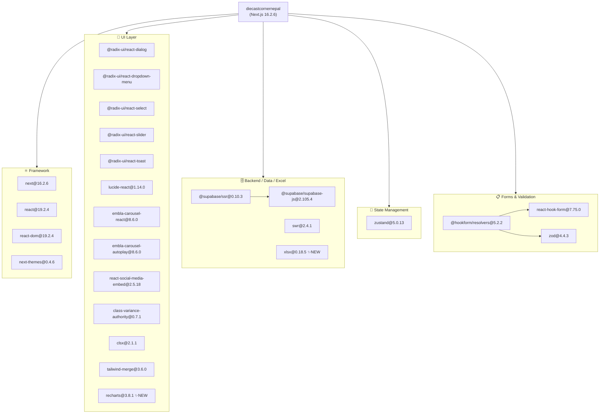
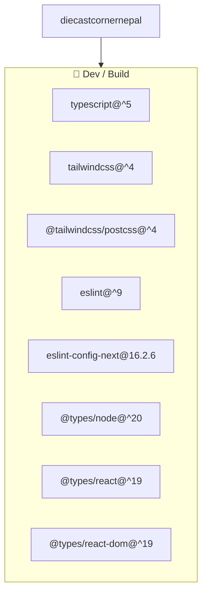
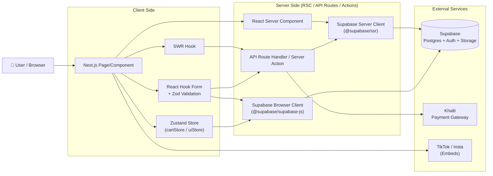

# Dependency Graph — The Diecast Corner Nepal
> Last updated: 2026-05-19 | Reflects accounting, analytics dashboard, reporting module, and dynamic settings additions

## 1. NPM Package Dependencies

### Runtime Dependencies

### Dev Dependencies

---

## 2. Internal Module Dependency Graph

### Core Architecture

```mermaid
graph TD
  subgraph AppShell ["🏠 App Shell"]
    LAYOUT["src/app/layout.tsx"]
    GLOBALS["src/app/globals.css"]
  end

  subgraph Pages_Store ["🛒 Store Routes (store)"]
    HOME["(store)/page.tsx — Homepage"]
    SHOP["(store)/shop/page.tsx"]
    PRODUCT["(store)/product/[slug]/page.tsx"]
    CART["(store)/cart/page.tsx"]
    CHECKOUT["(store)/checkout/page.tsx 🔧UPDATED"]
    ORDER_SUCCESS["(store)/order/success/[id]/page.tsx"]
    BRANDS["(store)/brands/page.tsx"]
    NEW_ARRIVALS["(store)/new-arrivals/page.tsx"]
    TREASURE["(store)/treasure-hunt/page.tsx"]
    STORE_LAYOUT["(store)/layout.tsx"]
  end

  subgraph Pages_Auth ["🔐 Auth Routes (auth)"]
    LOGIN["(auth)/login/page.tsx"]
    REGISTER["(auth)/register/page.tsx"]
    AUTH_LAYOUT["(auth)/layout.tsx"]
  end

  subgraph Pages_Account ["👤 Account Routes (account)"]
    ACCOUNT["(account)/account/page.tsx"]
    WISHLIST["(account)/account/wishlist/page.tsx"]
    ACC_LAYOUT["(account)/layout.tsx"]
  end

  subgraph Pages_Admin ["⚙️ Admin Routes"]
    ADMIN_HOME["admin/(dashboard)/page.tsx 🔧UPDATED"]
    ADMIN_ACCOUNTING["admin/accounting/page.tsx ✨NEW"]
    ADMIN_EXPENSES["admin/accounting/expenses/page.tsx ✨NEW"]
    ADMIN_EXPENSE_NEW["admin/accounting/expenses/new/page.tsx ✨NEW"]
    ADMIN_PAYOUTS["admin/accounting/payouts/page.tsx ✨NEW"]
    ADMIN_JOURNAL["admin/accounting/journal/page.tsx ✨NEW"]
    ADMIN_REPORTS_LIST["admin/reports/page.tsx ✨NEW"]
    ADMIN_REPORT_VIEW["admin/reports/[reportType]/page.tsx ✨NEW"]
    ADMIN_PRODUCTS["admin/products/page.tsx"]
    ADMIN_PROD_NEW["admin/products/new/page.tsx"]
    ADMIN_PROD_EDIT["admin/products/[id]/edit/page.tsx"]
    ADMIN_ORDERS["admin/orders/page.tsx"]
    ADMIN_ORDER_DETAIL["admin/orders/[id]/page.tsx"]
    ADMIN_CATEGORIES["admin/categories/page.tsx"]
    ADMIN_CAT_NEW["admin/categories/new/page.tsx"]
    ADMIN_CAT_EDIT["admin/categories/[id]/edit/page.tsx"]
    ADMIN_SETTINGS["admin/settings/page.tsx 🔧UPDATED"]
    ADMIN_BANNERS["admin/banners/page.tsx"]
    ADMIN_MEDIA["admin/media/page.tsx"]
    ADMIN_LAYOUT["admin/layout.tsx 🔧UPDATED"]
  end

  subgraph API ["📡 API Routes & Actions"]
    API_ORDERS["api/orders/route.ts"]
    API_KHALTI_INIT["api/payment/khalti/initiate/route.ts"]
    API_KHALTI_VERIFY["api/payment/khalti/verify/route.ts"]
    API_KHALTI_WEBHOOK["api/payment/khalti/webhook/route.ts"]
    API_CART_SYNC["api/cart/sync/route.ts"]
    API_AUTH_CALLBACK["api/auth/callback/route.ts"]
    API_AUTH_SIGNOUT["api/auth/signout/route.ts"]
    API_WISHLIST["api/wishlist/route.ts"]
    API_WISHLIST_SYNC["api/wishlist/sync/route.ts"]
    ACTION_BULK_IMPORT["admin/products/actions.ts"]
    ACTION_ACCOUNTING["admin/accounting/actions.ts ✨NEW"]
    ACTION_DASHBOARD["admin/(dashboard)/actions.ts ✨NEW"]
    ACTION_REPORTS["admin/reports/actions.ts ✨NEW"]
  end

  subgraph Components_Layout ["🧱 Layout Components"]
    NAVBAR["components/layout/Navbar.tsx"]
    FOOTER["components/layout/Footer.tsx"]
    ANNOUNCEMENT["components/layout/AnnouncementBar.tsx"]
  end

  subgraph Components_Home ["🏡 Home Components"]
    HERO["components/home/HeroSection.tsx"]
    BANNER_CAROUSEL["components/home/BannerCarousel.tsx"]
    BANNER_SLIDE["components/home/BannerSlide.tsx"]
    FEATURED["components/home/FeaturedDrops.tsx"]
    NEW_ARR_COMP["components/home/NewArrivals.tsx"]
    SOCIAL["components/home/SocialStrip.tsx"]
    COLL_MEDIA_GALLERY["components/home/CollectorMediaGallery.tsx"]
    TREASURE_COMP["components/home/TreasureHuntZone.tsx"]
    WHY_US["components/home/WhyChooseUs.tsx"]
  end

  subgraph Components_Store ["🏪 Store Components"]
    CART_DRAWER["components/store/CartDrawer.tsx"]
    PRODUCT_CARD["components/store/ProductCard.tsx"]
    PRODUCT_GALLERY["components/store/ProductGallery.tsx"]
    PRODUCT_MEDIA["components/store/ProductMediaGallery.tsx"]
    PRODUCT_GRID["components/store/ProductGrid.tsx"]
    SHOP_FILTERS["components/store/ShopFilters.tsx"]
    ADD_TO_CART_BTN["components/store/AddToCartDetailButton.tsx"]
  end

  subgraph Components_Admin ["🛠️ Admin Components"]
    ORDER_STATUS["components/admin/OrderStatusUpdater.tsx"]
    PRODUCT_FORM["components/admin/ProductForm.tsx"]
    PRODUCT_BULK_IMPORT["components/admin/ProductBulkImport.tsx"]
    PRODUCT_MEDIA_MANAGER["components/admin/ProductMediaManager.tsx"]
    SOCIAL_GALLERY_MANAGER["components/admin/SocialGalleryManager.tsx"]
    BANNER_FORM["components/admin/BannerForm.tsx"]
    CATEGORY_FORM["components/admin/CategoryForm.tsx"]
    DASHBOARD_VIEW["admin/(dashboard)/_components/AnalyticsDashboard.tsx ✨NEW"]
    EXPORT_BAR["admin/reports/_components/ExportBar.tsx ✨NEW"]
    REPORT_FILTERS["admin/reports/_components/ReportFilters.tsx ✨NEW"]
    REPORT_TABLE["admin/reports/_components/ReportTable.tsx ✨NEW"]
    REPORT_VIEWER["admin/reports/_components/ReportViewer.tsx ✨NEW"]
  end

  subgraph Components_UI ["🎨 UI Primitives"]
    BADGE["components/ui/badge.tsx"]
    BUTTON["components/ui/button.tsx"]
    INPUT["components/ui/input.tsx"]
    SKELETON["components/ui/skeleton.tsx"]
    VIDEO_EMBED["components/ui/VideoEmbed.tsx"]
    MEDIA_CARD["components/ui/MediaCard.tsx"]
  end

  subgraph Stores ["📦 Zustand Stores"]
    CART_STORE["store/cartStore.ts"]
    UI_STORE["store/uiStore.ts"]
    WISHLIST_STORE["store/wishlistStore.ts"]
  end

  subgraph Lib ["📚 Lib / Shared"]
    SB_CLIENT["lib/supabase/client.ts"]
    SB_SERVER["lib/supabase/server.ts"]
    Q_PRODUCTS["lib/supabase/queries/products.ts"]
    Q_CATEGORIES["lib/supabase/queries/categories.ts"]
    Q_ORDERS["lib/supabase/queries/orders.ts"]
    Q_BANNERS["lib/supabase/queries/banners.ts"]
    Q_MEDIA["lib/supabase/queries/media.ts"]
    Q_ANALYTICS["lib/supabase/queries/analytics-advanced.ts 🔧UPDATED"]
    Q_ACCOUNTING["lib/supabase/queries/accounting.ts ✨NEW"]
    Q_REPORTS["lib/supabase/queries/reports.ts ✨NEW"]
    TYPES_PRODUCT["lib/types/product.ts"]
    TYPES_MEDIA["lib/types/media.ts"]
    TYPES_ACCOUNTING["lib/types/accounting.ts ✨NEW"]
    TYPES_ANALYTICS["lib/types/analytics.ts ✨NEW"]
    TYPES_AUDIT["lib/types/audit.ts ✨NEW"]
    UTILS["lib/utils.ts"]
    EXPORT_UTIL["lib/utils/export.ts ✨NEW"]
    CONSTANTS["lib/constants.ts"]
  end

  subgraph Static ["📁 Static Assets"]
    PLACEHOLDER["public/placeholder-car.jpg"]
    CSV_TEMPLATE["public/products_template.csv"]
    LOGO_KHALTI["public/logos/khalti.png"]
    LOGO_ESEWA["public/logos/esewa.png"]
  end

  %% App Shell
  LAYOUT --> NAVBAR
  LAYOUT --> FOOTER
  LAYOUT --> ANNOUNCEMENT
  LAYOUT --> CART_DRAWER

  %% Home page integration
  HOME --> BANNER_CAROUSEL
  HOME --> FEATURED
  HOME --> COLL_MEDIA_GALLERY
  HOME --> NEW_ARR_COMP

  %% Store UI
  SHOP --> PRODUCT_GRID
  PRODUCT_GRID --> PRODUCT_CARD
  PRODUCT --> PRODUCT_MEDIA
  PRODUCT --> ADD_TO_CART_BTN
  CHECKOUT --> LOGO_KHALTI
  CHECKOUT --> LOGO_ESEWA

  %% Admin Routing
  ADMIN_LAYOUT --> ADMIN_HOME
  ADMIN_LAYOUT --> ADMIN_ACCOUNTING
  ADMIN_LAYOUT --> ADMIN_REPORTS_LIST

  %% Admin Accounting
  ADMIN_EXPENSES --> Q_ACCOUNTING
  ADMIN_EXPENSES --> ACTION_ACCOUNTING
  ADMIN_PAYOUTS --> Q_ACCOUNTING
  ADMIN_JOURNAL --> Q_ACCOUNTING

  %% Admin Analytics Dashboard
  ADMIN_HOME --> DASHBOARD_VIEW
  DASHBOARD_VIEW --> Q_ANALYTICS
  DASHBOARD_VIEW --> ACTION_DASHBOARD

  %% Admin Reports
  ADMIN_REPORT_VIEW --> REPORT_VIEWER
  REPORT_VIEWER --> REPORT_TABLE
  REPORT_VIEWER --> REPORT_FILTERS
  REPORT_VIEWER --> EXPORT_BAR
  EXPORT_BAR --> EXPORT_UTIL
  EXPORT_UTIL --> XLSX
  REPORT_VIEWER --> Q_REPORTS
  REPORT_VIEWER --> ACTION_REPORTS

  %% UI primitives used
  PRODUCT_CARD --> BADGE
  PRODUCT_MEDIA --> VIDEO_EMBED
  COLL_MEDIA_GALLERY --> MEDIA_CARD

  %% Zustand stores
  NAVBAR --> CART_STORE
  PRODUCT_CARD --> CART_STORE
  PRODUCT_CARD --> WISHLIST_STORE

  %% Queries → Supabase clients
  Q_PRODUCTS --> SB_SERVER
  Q_BANNERS --> SB_SERVER
  Q_MEDIA --> SB_SERVER
  Q_ACCOUNTING --> SB_SERVER
  Q_ANALYTICS --> SB_SERVER
  Q_REPORTS --> SB_SERVER
  SB_CLIENT --> SUPABASE_JS[("@supabase/supabase-js")]
  SB_SERVER --> SUPABASE_SSR[("@supabase/ssr")]
```

---

## 3. Data Flow Diagram

---

## 4. Database Schema & RLS Policy Map

```mermaid
graph TD
  subgraph Tables ["📊 Supabase Tables"]
    T_PROFILES["profiles"]
    T_PRODUCTS["products"]
    T_PRODUCT_IMAGES["product_images"]
    T_PRODUCT_VIDEOS["product_videos"]
    T_CATEGORIES["categories"]
    T_BANNERS["banners"]
    T_SOCIAL_GALLERY["social_gallery"]
    T_ORDERS["orders"]
    T_CART_ITEMS["cart_items"]
    T_WISHLIST["wishlist_items"]
    T_EXPENSES["expenses ✨NEW"]
    T_PAYOUTS["payouts ✨NEW"]
    T_JOURNAL["journal_entries ✨NEW"]
    T_AUDIT["audit_logs ✨NEW"]
    T_SETTINGS["site_settings 🔧UPDATED"]
  end

  subgraph RLS ["🔒 RLS Access Rules"]
    PUBLIC_READ["Public: SELECT only"]
    USER_OWN["User: own rows only"]
    ADMIN_ALL["Admin: full CRUD<br/>(role='admin' in profiles)"]
  end

  T_PRODUCTS --> PUBLIC_READ
  T_PRODUCTS --> ADMIN_ALL
  T_PRODUCT_IMAGES --> PUBLIC_READ
  T_PRODUCT_IMAGES --> ADMIN_ALL
  T_PRODUCT_VIDEOS --> PUBLIC_READ
  T_PRODUCT_VIDEOS --> ADMIN_ALL
  T_CATEGORIES --> PUBLIC_READ
  T_CATEGORIES --> ADMIN_ALL
  T_BANNERS --> PUBLIC_READ
  T_BANNERS --> ADMIN_ALL
  T_SOCIAL_GALLERY --> PUBLIC_READ
  T_SOCIAL_GALLERY --> ADMIN_ALL
  T_PROFILES --> USER_OWN
  T_ORDERS --> USER_OWN
  T_ORDERS --> ADMIN_ALL
  T_CART_ITEMS --> USER_OWN
  T_WISHLIST --> USER_OWN
  T_SETTINGS --> PUBLIC_READ
  T_SETTINGS --> ADMIN_ALL
  T_EXPENSES --> ADMIN_ALL
  T_PAYOUTS --> ADMIN_ALL
  T_JOURNAL --> ADMIN_ALL
  T_AUDIT --> ADMIN_ALL
```

---

## 5. Summary Table

| Layer | Modules |
|---|---|
| **Pages (Store)** | `/`, `/shop`, `/product/[slug]`, `/cart`, `/checkout` 🔧, `/brands`, `/new-arrivals`, `/treasure-hunt` |
| **Pages (Admin)** | `/admin` 🔧, `/admin/accounting` ✨, `/admin/accounting/expenses` ✨, `/admin/accounting/expenses/new` ✨, `/admin/accounting/payouts` ✨, `/admin/accounting/journal` ✨, `/admin/reports` ✨, `/admin/reports/[reportType]` ✨, `/admin/products`, `/admin/orders`, `/admin/banners`, `/admin/media`, `/admin/categories`, `/admin/settings` 🔧 |
| **API & Actions** | `api/orders`, `api/payment/khalti/*`, `api/wishlist/*`, `admin/products/actions.ts`, `admin/accounting/actions.ts` ✨, `admin/(dashboard)/actions.ts` ✨, `admin/reports/actions.ts` ✨ |
| **Home Components** | `HeroSection`, `BannerCarousel`, `FeaturedDrops`, `CollectorMediaGallery`, `TreasureHuntZone` |
| **Store Components** | `CartDrawer`, `ProductCard`, `ProductMediaGallery`, `ProductGrid`, `ShopFilters`, `AddToCartDetailButton` |
| **Admin Components** | `AnalyticsDashboard` ✨, `ReportViewer` ✨, `ReportTable` ✨, `ReportFilters` ✨, `ExportBar` ✨, `ProductBulkImport`, `ProductMediaManager`, `SocialGalleryManager`, `BannerForm`, `OrderStatusUpdater`, `ProductForm`, `CategoryForm` |
| **UI Primitives** | `Badge`, `Button`, `Input`, `Skeleton`, `VideoEmbed`, `MediaCard` |
| **State (Zustand)** | `cartStore`, `uiStore`, `wishlistStore` |
| **Data Layer** | `lib/supabase/queries/` — products, categories, orders, banners, media, accounting ✨, analytics-advanced 🔧, reports ✨ |
| **Types** | `lib/types/product.ts`, `lib/types/media.ts`, `lib/types/accounting.ts` ✨, `lib/types/analytics.ts` ✨, `lib/types/audit.ts` ✨ |
| **Shared Utils** | `lib/utils.ts`, `lib/constants.ts`, `lib/utils/export.ts` ✨ |
| **Static Assets** | `public/placeholder-car.jpg`, `public/products_template.csv`, `public/logos/khalti.png`, `public/logos/esewa.png` |

**Legend:** ✨ New since last graph &nbsp;|&nbsp; 🔧 Modified since last graph
