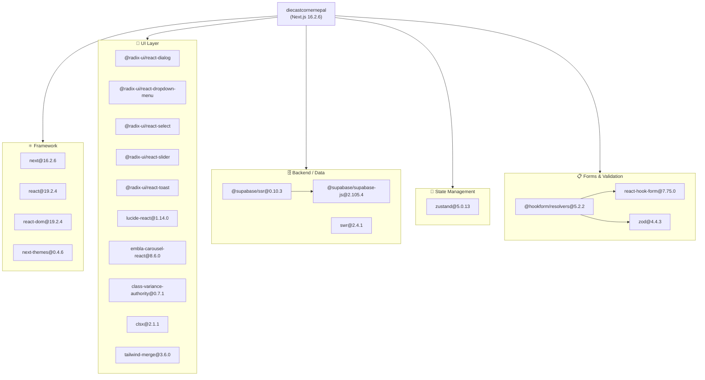
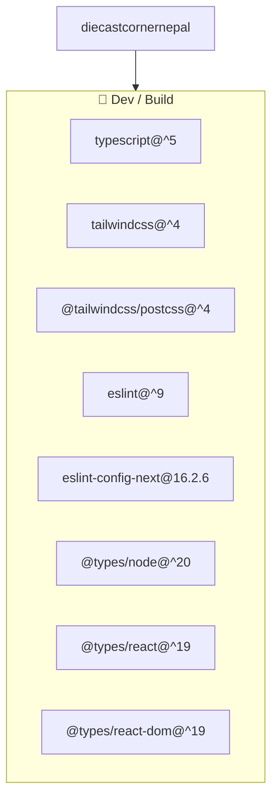
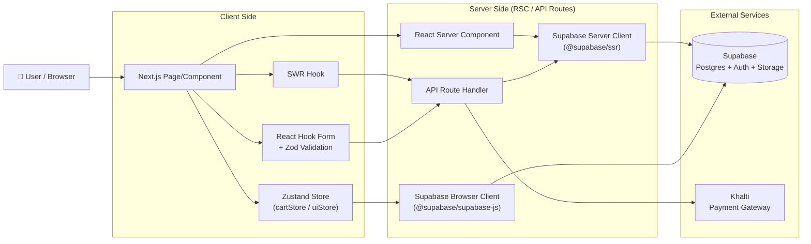

# Dependency Graph — The Diecast Corner Nepal

## 1. NPM Package Dependencies

### Runtime Dependencies

### Dev Dependencies

---

## 2. Internal Module Dependency Graph

### Core Architecture

```mermaid
graph TD
  subgraph AppShell ["🏠 App Shell"]
    LAYOUT["src/app/layout.tsx"]
    GLOBALS["src/app/globals.css"]
  end

  subgraph Pages_Store ["🛒 Store Routes (store)"]
    HOME["(store)/page.tsx — Homepage"]
    SHOP["(store)/shop/page.tsx"]
    PRODUCT["(store)/product/[slug]/page.tsx"]
    CART["(store)/cart/page.tsx"]
    ORDER_SUCCESS["(store)/order/success/page.tsx"]
    BRANDS["(store)/brands/page.tsx"]
    NEW_ARRIVALS["(store)/new-arrivals/page.tsx"]
    TREASURE["(store)/treasure-hunt/page.tsx"]
    STORE_LAYOUT["(store)/layout.tsx"]
  end

  subgraph Pages_Auth ["🔐 Auth Routes (auth)"]
    LOGIN["(auth)/login/page.tsx"]
    REGISTER["(auth)/register/page.tsx"]
    AUTH_LAYOUT["(auth)/layout.tsx"]
  end

  subgraph Pages_Account ["👤 Account Routes (account)"]
    ACCOUNT["(account)/account/page.tsx"]
    ACC_LAYOUT["(account)/layout.tsx"]
  end

  subgraph Pages_Admin ["⚙️ Admin Routes"]
    ADMIN_HOME["admin/page.tsx"]
    ADMIN_PRODUCTS["admin/products/page.tsx"]
    ADMIN_ORDERS["admin/orders/page.tsx"]
    ADMIN_CATEGORIES["admin/categories/page.tsx"]
    ADMIN_ANALYTICS["admin/analytics/page.tsx"]
    ADMIN_SETTINGS["admin/settings/page.tsx"]
    ADMIN_LAYOUT["admin/layout.tsx"]
  end

  subgraph API ["📡 API Routes"]
    API_ORDERS["api/orders/route.ts"]
    API_KHALTI_INIT["api/payment/khalti/initiate/route.ts"]
    API_KHALTI_VERIFY["api/payment/khalti/verify/route.ts"]
    API_AUTH["api/auth/route.ts"]
  end

  subgraph Components_Layout ["🧱 Layout Components"]
    NAVBAR["components/layout/Navbar.tsx"]
    FOOTER["components/layout/Footer.tsx"]
    ANNOUNCEMENT["components/layout/AnnouncementBar.tsx"]
  end

  subgraph Components_Home ["🏡 Home Components"]
    HERO["components/home/HeroSection.tsx"]
    FEATURED["components/home/FeaturedDrops.tsx"]
    NEW_ARR_COMP["components/home/NewArrivals.tsx"]
    SOCIAL["components/home/SocialStrip.tsx"]
    TREASURE_COMP["components/home/TreasureHuntZone.tsx"]
    WHY_US["components/home/WhyChooseUs.tsx"]
  end

  subgraph Components_Store ["🏪 Store Components"]
    CART_DRAWER["components/store/CartDrawer.tsx"]
    PRODUCT_CARD["components/store/ProductCard.tsx"]
    PRODUCT_GALLERY["components/store/ProductGallery.tsx"]
    PRODUCT_GRID["components/store/ProductGrid.tsx"]
    SHOP_FILTERS["components/store/ShopFilters.tsx"]
  end

  subgraph Components_Admin ["🛠️ Admin Components"]
    ORDER_STATUS["components/admin/OrderStatusUpdater.tsx"]
    PRODUCT_FORM["components/admin/ProductForm.tsx"]
  end

  subgraph Components_UI ["🎨 UI Primitives"]
    BADGE["components/ui/badge.tsx"]
    BUTTON["components/ui/button.tsx"]
    INPUT["components/ui/input.tsx"]
    SKELETON["components/ui/skeleton.tsx"]
  end

  subgraph Stores ["📦 Zustand Stores"]
    CART_STORE["store/cartStore.ts"]
    UI_STORE["store/uiStore.ts"]
  end

  subgraph Lib ["📚 Lib / Shared"]
    SB_CLIENT["lib/supabase/client.ts"]
    SB_SERVER["lib/supabase/server.ts"]
    Q_PRODUCTS["lib/supabase/queries/products.ts"]
    Q_CATEGORIES["lib/supabase/queries/categories.ts"]
    Q_ORDERS["lib/supabase/queries/orders.ts"]
    Q_BANNERS["lib/supabase/queries/banners.ts"]
    TYPES["lib/types.ts"]
    UTILS["lib/utils.ts"]
    CONSTANTS["lib/constants.ts"]
    VAL_AUTH["lib/validations/auth.ts"]
    VAL_CHECKOUT["lib/validations/checkout.ts"]
    VAL_PRODUCT["lib/validations/product.ts"]
    PROXY["src/proxy.ts"]
  end

  %% App Shell
  LAYOUT --> NAVBAR
  LAYOUT --> FOOTER
  LAYOUT --> ANNOUNCEMENT
  LAYOUT --> CART_DRAWER

  %% Store pages → Layout
  STORE_LAYOUT --> NAVBAR
  STORE_LAYOUT --> FOOTER

  %% Home page → Home components
  HOME --> HERO
  HOME --> FEATURED
  HOME --> NEW_ARR_COMP
  HOME --> SOCIAL
  HOME --> TREASURE_COMP
  HOME --> WHY_US

  %% Store page → Store components
  SHOP --> PRODUCT_GRID
  SHOP --> SHOP_FILTERS
  PRODUCT_GRID --> PRODUCT_CARD
  PRODUCT --> PRODUCT_GALLERY
  PRODUCT --> PRODUCT_CARD

  %% UI primitives used by store components
  PRODUCT_CARD --> BADGE
  PRODUCT_CARD --> BUTTON
  CART_DRAWER --> BUTTON
  CART_DRAWER --> INPUT
  SHOP_FILTERS --> BUTTON
  PRODUCT_GALLERY --> BUTTON
  PRODUCT_FORM --> INPUT
  PRODUCT_FORM --> BUTTON
  PRODUCT_FORM --> BADGE

  %% Admin components → UI
  ORDER_STATUS --> BUTTON
  ORDER_STATUS --> BADGE

  %% Admin pages → Admin components
  ADMIN_PRODUCTS --> PRODUCT_FORM
  ADMIN_ORDERS --> ORDER_STATUS

  %% Zustand stores
  CART_DRAWER --> CART_STORE
  NAVBAR --> CART_STORE
  NAVBAR --> UI_STORE
  PRODUCT_CARD --> CART_STORE

  %% Queries → Supabase clients
  Q_PRODUCTS --> SB_SERVER
  Q_CATEGORIES --> SB_SERVER
  Q_ORDERS --> SB_SERVER
  Q_BANNERS --> SB_SERVER
  SB_CLIENT --> SUPABASE_JS[("@supabase/supabase-js")]
  SB_SERVER --> SUPABASE_SSR[("@supabase/ssr")]

  %% Pages → Queries
  HOME --> Q_PRODUCTS
  HOME --> Q_BANNERS
  SHOP --> Q_PRODUCTS
  SHOP --> Q_CATEGORIES
  PRODUCT --> Q_PRODUCTS
  ADMIN_HOME --> Q_ORDERS
  ADMIN_PRODUCTS --> Q_PRODUCTS
  ADMIN_ORDERS --> Q_ORDERS
  ADMIN_CATEGORIES --> Q_CATEGORIES

  %% API routes → Supabase
  API_ORDERS --> SB_SERVER
  API_KHALTI_INIT --> SB_SERVER
  API_KHALTI_VERIFY --> SB_SERVER

  %% Shared lib usage
  UTILS --> CLSX_DEP[("clsx + tailwind-merge")]
  PRODUCT_FORM --> VAL_PRODUCT
  LOGIN --> VAL_AUTH
  REGISTER --> VAL_AUTH
  CART_DRAWER --> VAL_CHECKOUT
  ORDER_SUCCESS --> VAL_CHECKOUT

  %% Types shared across
  Q_PRODUCTS --> TYPES
  Q_ORDERS --> TYPES
  Q_CATEGORIES --> TYPES
  CART_STORE --> TYPES
```

---

## 3. Data Flow Diagram

---

## 4. Route Hierarchy

```mermaid
graph TD
  ROOT["/"]

  ROOT --> STORE_GROUP["(store) group"]
  ROOT --> AUTH_GROUP["(auth) group"]
  ROOT --> ACC_GROUP["(account) group"]
  ROOT --> ADMIN_GROUP["admin/"]
  ROOT --> API_GROUP["api/"]

  STORE_GROUP --> R_HOME["/ — Homepage"]
  STORE_GROUP --> R_SHOP["shop/"]
  STORE_GROUP --> R_PRODUCT["product/[slug]/"]
  STORE_GROUP --> R_CART["cart/"]
  STORE_GROUP --> R_BRANDS["brands/"]
  STORE_GROUP --> R_NEW["new-arrivals/"]
  STORE_GROUP --> R_TREASURE["treasure-hunt/"]
  STORE_GROUP --> R_ORDER_OK["order/success/"]

  AUTH_GROUP --> R_LOGIN["login/"]
  AUTH_GROUP --> R_REGISTER["register/"]

  ACC_GROUP --> R_ACCOUNT["account/"]

  ADMIN_GROUP --> R_ADMIN["admin/ — Dashboard"]
  ADMIN_GROUP --> R_ADMIN_PROD["admin/products/"]
  ADMIN_GROUP --> R_ADMIN_ORDERS["admin/orders/"]
  ADMIN_GROUP --> R_ADMIN_CAT["admin/categories/"]
  ADMIN_GROUP --> R_ADMIN_ANA["admin/analytics/"]
  ADMIN_GROUP --> R_ADMIN_SET["admin/settings/"]

  API_GROUP --> R_API_ORDERS["api/orders/"]
  API_GROUP --> R_API_KHALTI_I["api/payment/khalti/initiate/"]
  API_GROUP --> R_API_KHALTI_V["api/payment/khalti/verify/"]
  API_GROUP --> R_API_AUTH["api/auth/"]
```

---

## 5. Summary Table

| Layer | Modules |
|---|---|
| **Pages (Store)** | `/`, `/shop`, `/product/[slug]`, `/cart`, `/order/success`, `/brands`, `/new-arrivals`, `/treasure-hunt` |
| **Pages (Auth)** | `/login`, `/register` |
| **Pages (Account)** | `/account` |
| **Pages (Admin)** | `/admin`, `/admin/products`, `/admin/orders`, `/admin/categories`, `/admin/analytics`, `/admin/settings` |
| **API Routes** | `/api/orders`, `/api/payment/khalti/initiate`, `/api/payment/khalti/verify`, `/api/auth` |
| **Layout Components** | `Navbar`, `Footer`, `AnnouncementBar` |
| **Home Components** | `HeroSection`, `FeaturedDrops`, `NewArrivals`, `SocialStrip`, `TreasureHuntZone`, `WhyChooseUs` |
| **Store Components** | `CartDrawer`, `ProductCard`, `ProductGallery`, `ProductGrid`, `ShopFilters` |
| **Admin Components** | `OrderStatusUpdater`, `ProductForm` |
| **UI Primitives** | `Badge`, `Button`, `Input`, `Skeleton` |
| **State (Zustand)** | `cartStore`, `uiStore` |
| **Data Layer** | `lib/supabase/queries/` — products, categories, orders, banners |
| **Supabase Clients** | `client.ts` (browser), `server.ts` (SSR) |
| **Validations (Zod)** | `auth.ts`, `checkout.ts`, `product.ts` |
| **Shared** | `lib/types.ts`, `lib/utils.ts`, `lib/constants.ts` |
| **External Services** | Supabase (Postgres + Auth + Storage), Khalti (Payment) |
