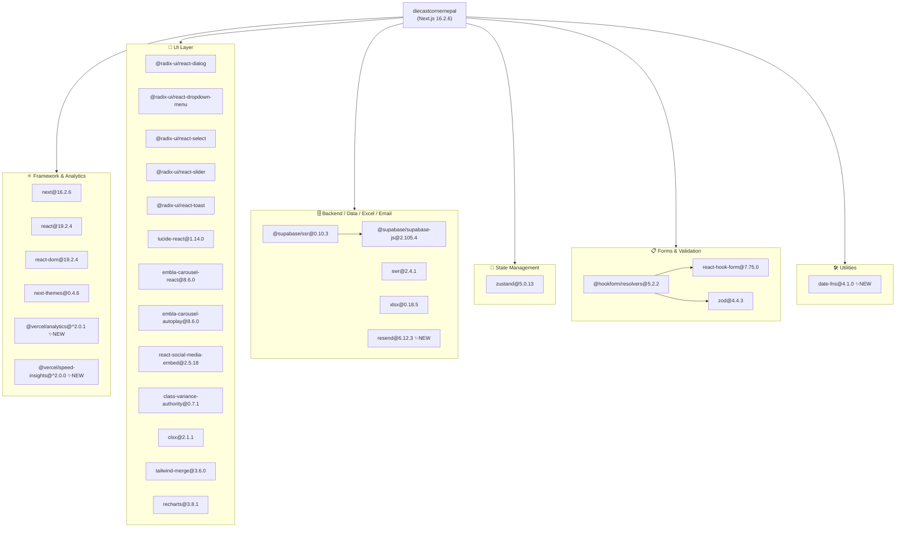
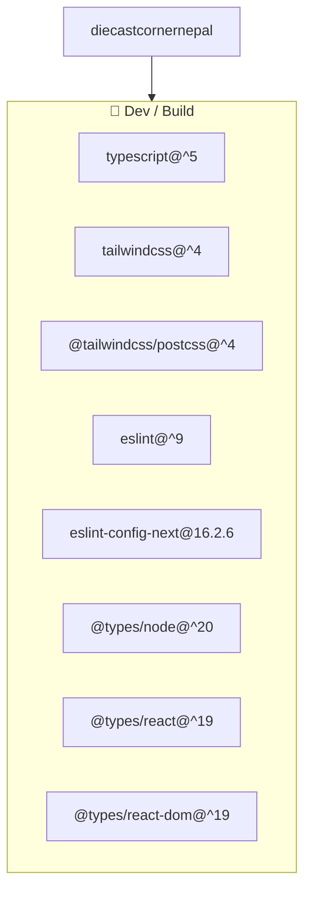
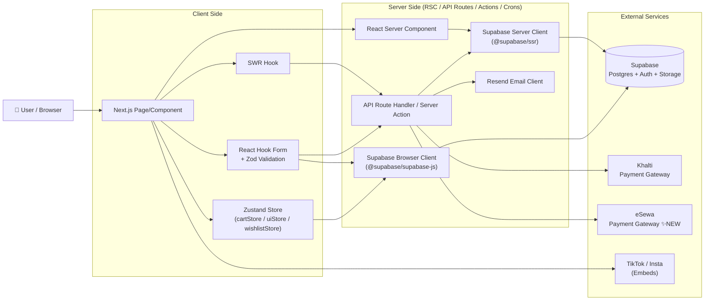

# Dependency Graph — The Diecast Corner Nepal
> Last updated: 2026-06-20 | Reflects inventory concurrency, product waitlist, reviews, pre-orders, variants, live drops, collector profiles, security hardening, eSewa payment integration, Vercel analytics & speed insights, and transactional emails

## 1. NPM Package Dependencies

### Runtime Dependencies

### Dev Dependencies

---

## 2. Internal Module Dependency Graph

### Core Architecture

```mermaid
graph TD
  subgraph AppShell ["🏠 App Shell"]
    LAYOUT["src/app/layout.tsx 🔧UPDATED"]
    GLOBALS["src/app/globals.css 🔧UPDATED"]
    SITEMAP["src/app/sitemap.ts 🔧UPDATED"]
    ROBOTS["src/app/robots.ts ✨NEW"]
    PROXY["src/proxy.ts 🔧UPDATED"]
  end

  subgraph Pages_Store ["🛒 Store Routes (store)"]
    HOME["(store)/page.tsx — Homepage"]
    SHOP["(store)/shop/page.tsx 🔧UPDATED"]
    PRODUCT["(store)/product/[slug]/page.tsx 🔧UPDATED"]
    CART["(store)/cart/page.tsx"]
    CHECKOUT["(store)/checkout/page.tsx 🔧UPDATED"]
    ORDER_SUCCESS["(store)/order/success/[id]/page.tsx"]
    ORDER_FAILURE["(store)/order/failure/page.tsx ✨NEW"]
    BRANDS["(store)/brands/page.tsx"]
    NEW_ARRIVALS["(store)/new-arrivals/page.tsx"]
    TREASURE["(store)/treasure-hunt/page.tsx"]
    STORE_LAYOUT["(store)/layout.tsx"]
    COLLECTOR["(store)/collector/[username]/page.tsx ✨NEW"]
    DROPS_LIST["(store)/drops/page.tsx ✨NEW"]
    DROP_DETAIL["(store)/drop/[id]/page.tsx ✨NEW"]
    DROP_WAITING["(store)/drop/[id]/waiting/page.tsx ✨NEW"]
    PREORDERS_LIST["(store)/pre-orders/page.tsx ✨NEW"]
    RETURN_POLICY["(store)/return-policy/page.tsx ✨NEW"]
    TERMS["(store)/terms-of-service/page.tsx ✨NEW"]
    SHIPPING["(store)/shipping-policy/page.tsx ✨NEW"]
    PRIVACY["(store)/privacy-policy/page.tsx ✨NEW"]
  end

  subgraph Pages_Auth ["🔐 Auth Routes (auth)"]
    LOGIN["(auth)/login/page.tsx"]
    REGISTER["(auth)/register/page.tsx"]
    AUTH_LAYOUT["(auth)/layout.tsx 🔧UPDATED"]
  end

  subgraph Pages_Account ["👤 Account Routes (account)"]
    ACCOUNT["(account)/account/page.tsx 🔧UPDATED"]
    WISHLIST["(account)/account/wishlist/page.tsx 🔧UPDATED"]
    GARAGE["(account)/account/garage/page.tsx ✨NEW"]
    ACC_LAYOUT["(account)/layout.tsx 🔧UPDATED"]
  end

  subgraph Pages_Admin ["⚙️ Admin Routes"]
    ADMIN_HOME["admin/(dashboard)/page.tsx 🔧UPDATED"]
    ADMIN_ACCOUNTING["admin/accounting/page.tsx"]
    ADMIN_EXPENSES["admin/accounting/expenses/page.tsx"]
    ADMIN_EXPENSE_NEW["admin/accounting/expenses/new/page.tsx"]
    ADMIN_PAYOUTS["admin/accounting/payouts/page.tsx"]
    ADMIN_JOURNAL["admin/accounting/journal/page.tsx"]
    ADMIN_REPORTS_LIST["admin/reports/page.tsx"]
    ADMIN_REPORT_VIEW["admin/reports/[reportType]/page.tsx 🔧UPDATED"]
    ADMIN_PRODUCTS["admin/products/page.tsx 🔧UPDATED"]
    ADMIN_PROD_NEW["admin/products/new/page.tsx"]
    ADMIN_PROD_EDIT["admin/products/[id]/edit/page.tsx"]
    ADMIN_ORDERS["admin/orders/page.tsx"]
    ADMIN_ORDER_DETAIL["admin/orders/[id]/page.tsx"]
    ADMIN_CATEGORIES["admin/categories/page.tsx"]
    ADMIN_CAT_NEW["admin/categories/new/page.tsx"]
    ADMIN_CAT_EDIT["admin/categories/[id]/edit/page.tsx"]
    ADMIN_SETTINGS["admin/settings/page.tsx"]
    ADMIN_BANNERS["admin/banners/page.tsx"]
    ADMIN_MEDIA["admin/media/page.tsx"]
    ADMIN_CUSTOMERS["admin/customers/page.tsx ✨NEW"]
    ADMIN_AUDIT["admin/audit/page.tsx ✨NEW"]
    ADMIN_DROPS["admin/drops/page.tsx ✨NEW"]
    ADMIN_PREORDERS["admin/preorders/page.tsx ✨NEW"]
    ADMIN_BRANDS["admin/brands/page.tsx ✨NEW"]
    ADMIN_LAYOUT["admin/layout.tsx"]
  end

  subgraph API ["📡 API Routes, Actions & Cron"]
    API_ORDERS["api/orders/route.ts 🔧UPDATED"]
    API_KHALTI_INIT["api/payment/khalti/initiate/route.ts"]
    API_KHALTI_VERIFY["api/payment/khalti/verify/route.ts 🔧UPDATED"]
    API_KHALTI_WEBHOOK["api/payment/khalti/webhook/route.ts 🔧UPDATED"]
    API_ESEWA_INIT["api/payment/esewa/initiate/route.ts ✨NEW"]
    API_ESEWA_VERIFY["api/payment/esewa/verify/route.ts ✨NEW"]
    API_CART_SYNC["api/cart/sync/route.ts 🔧UPDATED"]
    API_CART_RESERVE["api/cart/reserve/route.ts ✨NEW"]
    API_AUTH_CALLBACK["api/auth/callback/route.ts 🔧UPDATED"]
    API_AUTH_SIGNOUT["api/auth/signout/route.ts 🔧UPDATED"]
    API_WISHLIST["api/wishlist/route.ts"]
    API_WISHLIST_SYNC["api/wishlist/sync/route.ts"]
    API_SEARCH["api/search/route.ts ✨NEW"]
    API_CRON_ABANDONED["api/cron/abandoned-cart/route.ts ✨NEW"]
    ACTION_BULK_IMPORT["admin/products/actions.ts 🔧UPDATED"]
    ACTION_ACCOUNTING["admin/accounting/actions.ts 🔧UPDATED"]
    ACTION_DASHBOARD["admin/(dashboard)/actions.ts 🔧UPDATED"]
    ACTION_REPORTS["admin/reports/actions.ts 🔧UPDATED"]
    ACTION_ORDERS["admin/orders/actions.ts 🔧UPDATED"]
    ACTION_PRODUCT_STORE["(store)/product/actions.ts ✨NEW"]
  end

  subgraph Components_Layout ["🧱 Layout Components"]
    NAVBAR["components/layout/Navbar.tsx 🔧UPDATED"]
    CLIENT_NAVBAR["components/layout/ClientNavbar.tsx ✨NEW"]
    FOOTER["components/layout/Footer.tsx 🔧UPDATED"]
    ANNOUNCEMENT["components/layout/AnnouncementBar.tsx 🔧UPDATED"]
  end

  subgraph Components_Home ["🏡 Home Components"]
    HERO["components/home/HeroSection.tsx"]
    BANNER_CAROUSEL["components/home/BannerCarousel.tsx 🔧UPDATED"]
    BANNER_SLIDE["components/home/BannerSlide.tsx"]
    FEATURED["components/home/FeaturedDrops.tsx"]
    NEW_ARR_COMP["components/home/NewArrivals.tsx"]
    SOCIAL["components/home/SocialStrip.tsx"]
    COLL_MEDIA_GALLERY["components/home/CollectorMediaGallery.tsx"]
    TREASURE_COMP["components/home/TreasureHuntZone.tsx"]
    WHY_US["components/home/WhyChooseUs.tsx"]
  end

  subgraph Components_Store ["🏪 Store Components"]
    CART_DRAWER["components/store/CartDrawer.tsx 🔧UPDATED"]
    PRODUCT_CARD["components/store/ProductCard.tsx 🔧UPDATED"]
    PRODUCT_GALLERY["components/store/ProductGallery.tsx"]
    PRODUCT_MEDIA["components/store/ProductMediaGallery.tsx"]
    PRODUCT_GRID["components/store/ProductGrid.tsx"]
    SHOP_FILTERS["components/store/ShopFilters.tsx 🔧UPDATED"]
    ADD_TO_CART_BTN["components/store/AddToCartDetailButton.tsx 🔧UPDATED"]
    WAITLIST_FORM["components/store/WaitlistForm.tsx ✨NEW"]
    PRODUCT_REVIEWS["components/store/ProductReviews.tsx ✨NEW"]
    VARIANT_SELECTOR["components/store/ProductVariantSelector.tsx ✨NEW"]
    STOCK_INDICATOR["components/store/LiveStockIndicator.tsx ✨NEW"]
    PREORDER_BTN["components/store/PreorderButton.tsx ✨NEW"]
    PREORDER_MODAL["components/store/PreorderModal.tsx ✨NEW"]
    PRODUCT_CLIENT_ACTIONS["components/store/ProductClientActions.tsx ✨NEW"]
    RECOM_RAIL["components/store/RecommendationRail.tsx ✨NEW"]
    RESERVATION_TIMER["components/store/ReservationTimer.tsx ✨NEW"]
    DROP_COUNTDOWN["components/store/DropCountdown.tsx ✨NEW"]
    SEARCH_MODAL["components/store/SearchModal.tsx 🔧UPDATED"]
  end

  subgraph Components_Admin ["🛠️ Admin Components"]
    ORDER_STATUS["components/admin/OrderStatusUpdater.tsx 🔧UPDATED"]
    PRODUCT_FORM["components/admin/ProductForm.tsx 🔧UPDATED"]
    PRODUCT_BULK_IMPORT["components/admin/ProductBulkImport.tsx 🔧UPDATED"]
    PRODUCT_MEDIA_MANAGER["components/admin/ProductMediaManager.tsx 🔧UPDATED"]
    SOCIAL_GALLERY_MANAGER["components/admin/SocialGalleryManager.tsx 🔧UPDATED"]
    BANNER_FORM["components/admin/BannerForm.tsx 🔧UPDATED"]
    CATEGORY_FORM["components/admin/CategoryForm.tsx"]
    DASHBOARD_VIEW["admin/(dashboard)/_components/AnalyticsDashboard.tsx 🔧UPDATED"]
    ENGAGEMENT_TAB["admin/(dashboard)/_components/EngagementTab.tsx ✨NEW"]
    EXPORT_BAR["admin/reports/_components/ExportBar.tsx"]
    REPORT_FILTERS["admin/reports/_components/ReportFilters.tsx"]
    REPORT_TABLE["admin/reports/_components/ReportTable.tsx"]
    REPORT_VIEWER["admin/reports/_components/ReportViewer.tsx"]
    VARIANT_MANAGER["components/admin/VariantManager.tsx ✨NEW"]
  end

  subgraph Components_UI ["🎨 UI Primitives"]
    BADGE["components/ui/badge.tsx"]
    BUTTON["components/ui/button.tsx"]
    INPUT["components/ui/input.tsx"]
    SKELETON["components/ui/skeleton.tsx 🔧UPDATED"]
    VIDEO_EMBED["components/ui/VideoEmbed.tsx"]
    MEDIA_CARD["components/ui/MediaCard.tsx"]
    COUNTDOWN_TIMER["components/ui/CountdownTimer.tsx ✨NEW"]
    QUICK_VIEW["components/ui/QuickViewModal.tsx ✨NEW"]
    SHIMMER["components/ui/ShimmerSkeleton.tsx ✨NEW"]
    SEO_JSONLD["components/seo/JsonLd.tsx ✨NEW"]
  end

  subgraph Stores ["📦 Zustand Stores"]
    CART_STORE["store/cartStore.ts 🔧UPDATED"]
    UI_STORE["store/uiStore.ts"]
    WISHLIST_STORE["store/wishlistStore.ts"]
  end

  subgraph Lib ["📚 Lib / Shared"]
    SB_CLIENT["lib/supabase/client.ts"]
    SB_SERVER["lib/supabase/server.ts 🔧UPDATED"]
    Q_PRODUCTS["lib/supabase/queries/products.ts 🔧UPDATED"]
    Q_CATEGORIES["lib/supabase/queries/categories.ts"]
    Q_ORDERS["lib/supabase/queries/orders.ts"]
    Q_BANNERS["lib/supabase/queries/banners.ts"]
    Q_MEDIA["lib/supabase/queries/media.ts"]
    Q_ANALYTICS["lib/supabase/queries/analytics-advanced.ts 🔧UPDATED"]
    Q_ACCOUNTING["lib/supabase/queries/accounting.ts"]
    Q_REPORTS["lib/supabase/queries/reports.ts"]
    Q_CUSTOMERS["lib/supabase/queries/customers.ts ✨NEW"]
    Q_REVIEWS["lib/supabase/queries/reviews.ts ✨NEW"]
    Q_DROPS["lib/supabase/queries/drops.ts ✨NEW"]
    Q_PREORDERS["lib/supabase/queries/preorders.ts ✨NEW"]
    Q_RECOMMENDATIONS["lib/supabase/queries/recommendations.ts ✨NEW"]
    Q_SEARCH["lib/supabase/queries/search.ts ✨NEW"]
    Q_VARIANTS["lib/supabase/queries/variants.ts ✨NEW"]
    TYPES_PRODUCT["lib/types/product.ts 🔧UPDATED"]
    TYPES_MEDIA["lib/types/media.ts"]
    TYPES_ACCOUNTING["lib/types/accounting.ts"]
    TYPES_ANALYTICS["lib/types/analytics.ts"]
    TYPES_AUDIT["lib/types/audit.ts"]
    TYPES_USER["lib/types/user.ts ✨NEW"]
    TYPES_DROP["lib/types/drop.ts ✨NEW"]
    TYPES_PREORDER["lib/types/preorder.ts ✨NEW"]
    TYPES_VARIANT["lib/types/variant.ts ✨NEW"]
    TYPES_API["lib/types/api.ts 🔧UPDATED"]
    UTILS["lib/utils.ts"]
    EXPORT_UTIL["lib/utils/export.ts"]
    CONSTANTS["lib/constants.ts 🔧UPDATED"]
    COMPUTE_BADGES["lib/badges/compute.ts ✨NEW"]
    CSP["lib/csp.ts ✨NEW"]
    AUTH_UTILS["lib/supabase/auth-utils.ts ✨NEW"]
    RESEND_CLIENT["lib/resend.ts ✨NEW"]
    ORDER_EMAILS["lib/email/order-emails.ts ✨NEW"]
  end

  subgraph Static ["📁 Static Assets"]
    PLACEHOLDER["public/placeholder-car.jpg"]
    CSV_TEMPLATE["public/products_template.csv"]
    LOGO_KHALTI["public/logos/khalti.png"]
    LOGO_ESEWA["public/logos/esewa.png"]
  end

  %% App Shell
  LAYOUT --> NAVBAR
  NAVBAR --> CLIENT_NAVBAR
  LAYOUT --> FOOTER
  LAYOUT --> ANNOUNCEMENT
  LAYOUT --> CART_DRAWER
  LAYOUT --> SEO_JSONLD
  LAYOUT --> PROXY
  PROXY --> CSP

  %% Home page integration
  HOME --> BANNER_CAROUSEL
  HOME --> FEATURED
  HOME --> COLL_MEDIA_GALLERY
  HOME --> NEW_ARR_COMP

  %% Store UI
  SHOP --> PRODUCT_GRID
  PRODUCT_GRID --> PRODUCT_CARD
  PRODUCT --> PRODUCT_MEDIA
  PRODUCT --> ADD_TO_CART_BTN
  PRODUCT --> WAITLIST_FORM
  PRODUCT --> PRODUCT_REVIEWS
  PRODUCT --> VARIANT_SELECTOR
  PRODUCT --> STOCK_INDICATOR
  PRODUCT --> PREORDER_BTN
  PRODUCT --> RECOM_RAIL
  CHECKOUT --> LOGO_KHALTI
  CHECKOUT --> LOGO_ESEWA
  CART_DRAWER --> RESERVATION_TIMER

  %% Drops
  DROP_DETAIL --> DROP_COUNTDOWN
  DROP_DETAIL --> PRODUCT_CLIENT_ACTIONS
  DROP_WAITING --> PRODUCT_CLIENT_ACTIONS

  %% Admin Routing
  ADMIN_LAYOUT --> ADMIN_HOME
  ADMIN_LAYOUT --> ADMIN_ACCOUNTING
  ADMIN_LAYOUT --> ADMIN_REPORTS_LIST
  ADMIN_LAYOUT --> ADMIN_CUSTOMERS
  ADMIN_LAYOUT --> ADMIN_AUDIT
  ADMIN_LAYOUT --> ADMIN_DROPS
  ADMIN_LAYOUT --> ADMIN_PREORDERS
  ADMIN_LAYOUT --> ADMIN_BRANDS

  %% Admin Accounting & Reports
  ADMIN_EXPENSES --> Q_ACCOUNTING
  ADMIN_EXPENSES --> ACTION_ACCOUNTING
  ADMIN_PAYOUTS --> Q_ACCOUNTING
  ADMIN_JOURNAL --> Q_ACCOUNTING
  ADMIN_REPORT_VIEW --> REPORT_VIEWER
  REPORT_VIEWER --> REPORT_TABLE
  REPORT_VIEWER --> REPORT_FILTERS
  REPORT_VIEWER --> EXPORT_BAR
  EXPORT_BAR --> EXPORT_UTIL
  EXPORT_UTIL --> XLSX
  REPORT_VIEWER --> Q_REPORTS
  REPORT_VIEWER --> ACTION_REPORTS

  %% Admin Analytics Dashboard
  ADMIN_HOME --> DASHBOARD_VIEW
  DASHBOARD_VIEW --> Q_ANALYTICS
  DASHBOARD_VIEW --> ACTION_DASHBOARD
  DASHBOARD_VIEW --> ENGAGEMENT_TAB

  %% Admin Drops / Preorders
  ADMIN_DROPS --> Q_DROPS
  ADMIN_PREORDERS --> Q_PREORDERS

  %% UI primitives used
  PRODUCT_CARD --> BADGE
  PRODUCT_CARD --> COMPUTE_BADGES
  PRODUCT_MEDIA --> VIDEO_EMBED
  COLL_MEDIA_GALLERY --> MEDIA_CARD

  %% Zustand stores
  CLIENT_NAVBAR --> CART_STORE
  PRODUCT_CARD --> CART_STORE
  PRODUCT_CARD --> WISHLIST_STORE
  ADD_TO_CART_BTN --> CART_STORE
  CART_DRAWER --> CART_STORE

  %% Queries → Supabase clients / Resend
  Q_PRODUCTS --> SB_SERVER
  Q_BANNERS --> SB_SERVER
  Q_MEDIA --> SB_SERVER
  Q_ACCOUNTING --> SB_SERVER
  Q_ANALYTICS --> SB_SERVER
  Q_REPORTS --> SB_SERVER
  Q_CUSTOMERS --> SB_SERVER
  Q_REVIEWS --> SB_SERVER
  Q_DROPS --> SB_SERVER
  Q_PREORDERS --> SB_SERVER
  Q_RECOMMENDATIONS --> SB_SERVER
  Q_SEARCH --> SB_SERVER
  Q_VARIANTS --> SB_SERVER
  SB_CLIENT --> SUPABASE_JS[("@supabase/supabase-js")]
  SB_SERVER --> SUPABASE_SSR[("@supabase/ssr")]
  
  %% Email
  API_ORDERS --> RESEND_CLIENT
  ACTION_ORDERS --> RESEND_CLIENT
  RESEND_CLIENT --> ORDER_EMAILS
```

---

## 3. Data Flow Diagram

---

## 4. Database Schema & RLS Policy Map

```mermaid
graph TD
  subgraph Tables ["📊 Supabase Tables & Views"]
    T_PROFILES["profiles"]
    T_PRODUCTS["products"]
    T_PRODUCT_IMAGES["product_images"]
    T_PRODUCT_VIDEOS["product_videos"]
    T_CATEGORIES["categories"]
    T_BRANDS["brands"]
    T_BANNERS["banners"]
    T_SOCIAL_GALLERY["social_gallery"]
    T_ORDERS["orders"]
    T_ORDER_ITEMS["order_items"]
    T_CART_ITEMS["cart_items"]
    T_WISHLIST["wishlist_items"]
    T_EXPENSES["expenses"]
    T_PAYOUTS["payouts"]
    T_JOURNAL["journal_entries"]
    T_JOURNAL_ITEMS["journal_entry_items"]
    T_LEDGERS["ledgers"]
    T_ACCOUNT_HEADS["account_heads"]
    T_ACTIVITY_LOGS["activity_logs"]
    T_ORDER_STATUS_LOGS["order_status_logs"]
    T_PRICING_LOGS["pricing_change_logs"]
    T_SETTINGS["site_settings"]
    T_VARIANTS["product_variants ✨NEW"]
    T_PREORDERS["preorder_configs ✨NEW"]
    T_STOCK_RES["stock_reservations ✨NEW"]
    T_CART_SESS["cart_sessions ✨NEW"]
    T_DROPS["product_drops ✨NEW"]
    T_GARAGE["collector_garage ✨NEW"]
    T_REVIEWS["reviews ✨NEW"]
    T_WAITLIST["waitlist ✨NEW"]
    V_COLLECTOR_ITEMS["collector_items (View) ✨NEW"]
    V_PRODUCT_AFFINITY["product_affinity (Mat. View) ✨NEW"]
    V_TRENDING["trending_products (View) ✨NEW"]
  end

  subgraph RLS ["🔒 RLS Access Rules"]
    PUBLIC_READ["Public: SELECT only"]
    USER_OWN["User: own rows only"]
    ADMIN_ALL["Admin: full CRUD<br/>(role='admin' in profiles)"]
    SERVICE_ONLY["Service / API Only"]
    USER_PUBLIC["User: own rows / Public: if profiles.is_public"]
    ANYONE_JOIN["Anyone: INSERT / Admin: SELECT"]
  end

  T_PRODUCTS --> PUBLIC_READ
  T_PRODUCTS --> ADMIN_ALL
  T_PRODUCT_IMAGES --> PUBLIC_READ
  T_PRODUCT_IMAGES --> ADMIN_ALL
  T_PRODUCT_VIDEOS --> PUBLIC_READ
  T_PRODUCT_VIDEOS --> ADMIN_ALL
  T_CATEGORIES --> PUBLIC_READ
  T_CATEGORIES --> ADMIN_ALL
  T_BRANDS --> PUBLIC_READ
  T_BRANDS --> ADMIN_ALL
  T_BANNERS --> PUBLIC_READ
  T_BANNERS --> ADMIN_ALL
  T_SOCIAL_GALLERY --> PUBLIC_READ
  T_SOCIAL_GALLERY --> ADMIN_ALL
  T_PROFILES --> USER_OWN
  T_ORDERS --> USER_OWN
  T_ORDERS --> ADMIN_ALL
  T_ORDER_ITEMS --> USER_OWN
  T_ORDER_ITEMS --> ADMIN_ALL
  T_CART_ITEMS --> USER_OWN
  T_WISHLIST --> USER_OWN
  T_SETTINGS --> PUBLIC_READ
  T_SETTINGS --> ADMIN_ALL
  T_EXPENSES --> ADMIN_ALL
  T_PAYOUTS --> ADMIN_ALL
  T_JOURNAL --> ADMIN_ALL
  T_JOURNAL_ITEMS --> ADMIN_ALL
  T_LEDGERS --> ADMIN_ALL
  T_ACCOUNT_HEADS --> ADMIN_ALL
  T_ACTIVITY_LOGS --> ADMIN_ALL
  T_ORDER_STATUS_LOGS --> ADMIN_ALL
  T_PRICING_LOGS --> ADMIN_ALL
  
  T_VARIANTS --> PUBLIC_READ
  T_VARIANTS --> ADMIN_ALL
  T_PREORDERS --> PUBLIC_READ
  T_PREORDERS --> ADMIN_ALL
  T_STOCK_RES --> SERVICE_ONLY
  T_CART_SESS --> SERVICE_ONLY
  T_CART_SESS --> ADMIN_ALL
  T_DROPS --> PUBLIC_READ
  T_DROPS --> ADMIN_ALL
  T_GARAGE --> USER_OWN
  T_GARAGE --> USER_PUBLIC
  T_REVIEWS --> PUBLIC_READ
  T_REVIEWS --> USER_OWN
  T_WAITLIST --> ANYONE_JOIN
```

---

## 5. Summary Table

| Layer | Modules |
|---|---|
| **Pages (Store)** | `/`, `/shop` 🔧, `/product/[slug]` 🔧, `/cart`, `/checkout` 🔧, `/brands`, `/new-arrivals`, `/treasure-hunt`, `/collector/[username]` ✨, `/drops` ✨, `/drop/[id]` ✨, `/drop/[id]/waiting` ✨, `/pre-orders` ✨, `/return-policy` ✨, `/terms-of-service` ✨, `/shipping-policy` ✨, `/privacy-policy` ✨, `/order/failure` ✨ |
| **Pages (Account)** | `/account` 🔧, `/account/wishlist` 🔧, `/account/garage` ✨, `/account/orders` ✨, `/account/orders/[id]` ✨ |
| **Pages (Admin)** | `/admin` 🔧, `/admin/accounting`, `/admin/accounting/expenses`, `/admin/accounting/expenses/new`, `/admin/accounting/payouts`, `/admin/accounting/journal`, `/admin/reports`, `/admin/reports/[reportType]` 🔧, `/admin/products` 🔧, `/admin/orders`, `/admin/banners`, `/admin/media`, `/admin/categories`, `/admin/settings`, `/admin/customers` ✨, `/admin/audit` ✨, `/admin/drops` ✨, `/admin/preorders` ✨, `/admin/brands` ✨ |
| **API, Actions & Cron** | `api/orders` 🔧, `api/payment/khalti/*` 🔧, `api/payment/esewa/*` ✨, `api/cart/sync` 🔧, `api/cart/reserve` ✨, `api/search` ✨, `api/cron/abandoned-cart` ✨, `api/wishlist/*`, `admin/products/actions.ts` 🔧, `admin/accounting/actions.ts` 🔧, `admin/(dashboard)/actions.ts` 🔧, `admin/reports/actions.ts` 🔧, `admin/orders/actions.ts` 🔧, `(store)/product/actions.ts` ✨ |
| **Home Components** | `HeroSection`, `BannerCarousel` 🔧, `FeaturedDrops`, `CollectorMediaGallery`, `TreasureHuntZone`, `WhyChooseUs`, `SocialStrip` |
| **Store Components** | `CartDrawer` 🔧, `ProductCard` 🔧, `ProductMediaGallery`, `ProductGrid`, `ShopFilters` 🔧, `AddToCartDetailButton` 🔧, `WaitlistForm` ✨, `ProductReviews` ✨, `ProductVariantSelector` ✨, `LiveStockIndicator` ✨, `PreorderButton` ✨, `PreorderModal` ✨, `ProductClientActions` ✨, `RecommendationRail` ✨, `ReservationTimer` ✨, `DropCountdown` ✨, `SearchModal` 🔧 |
| **Admin Components** | `AnalyticsDashboard` 🔧, `EngagementTab` ✨, `ReportViewer`, `ReportTable`, `ReportFilters`, `ExportBar`, `ProductBulkImport` 🔧, `ProductMediaManager` 🔧, `SocialGalleryManager` 🔧, `BannerForm` 🔧, `OrderStatusUpdater` 🔧, `ProductForm` 🔧, `CategoryForm`, `VariantManager` ✨ |
| **UI Primitives & SEO** | `Badge`, `Button`, `Input`, `Skeleton` 🔧, `VideoEmbed`, `MediaCard`, `CountdownTimer` ✨, `QuickViewModal` ✨, `ShimmerSkeleton` ✨, `seo/JsonLd` ✨ |
| **State (Zustand)** | `cartStore` 🔧, `uiStore`, `wishlistStore` |
| **Data Layer** | `lib/supabase/queries/` — products 🔧, categories, orders, banners, media, accounting, analytics-advanced 🔧, reports, customers ✨, reviews ✨, drops ✨, preorders ✨, recommendations ✨, search ✨, variants ✨ |
| **Types** | `lib/types/` — product 🔧, media, accounting, analytics, audit, user ✨, drop ✨, preorder ✨, variant ✨, api 🔧 |
| **Shared Utils & Email** | `lib/utils.ts`, `lib/constants.ts` 🔧, `lib/utils/export.ts`, `lib/badges/compute.ts` ✨, `lib/csp.ts` ✨, `lib/supabase/auth-utils.ts` ✨, `lib/resend.ts` ✨, `lib/email/order-emails.ts` ✨ |
| **Static Assets** | `public/placeholder-car.jpg`, `public/products_template.csv`, `public/logos/khalti.png`, `public/logos/esewa.png` |

**Legend:** ✨ New since last graph &nbsp;\|&nbsp; 🔧 Modified since last graph
